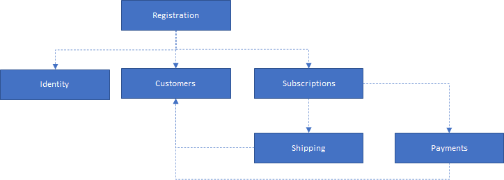

# Introduction

Welcome to the documentation of recommend-coffee. This example solution provides insights in how to build a microservice
solution with a data mesh in mind. In this introduction we'll cover the following topics:

* What is a data mesh?
* What is in this solution?
* Running the solution

## What is a data mesh?

A data mesh is a new approach to designing modern data architectures. It embraces organization structure by decoupling
several concepts such as data ownership, governance, and data quality management.

There are several similarities between a data mesh and a micro service architecture. We follow several concepts in a
data mesh that may sound familiar if you've designed micro services in the past.

Keep in mind that data mesh is a pretty new concept so not everything is quite as mature as with micro services.
For example, there are several frameworks available for building micro services. There aren't as many usable tools
for building a data mesh.

In this solution we follow [the 4 principles of data mesh architecture](02-data-mesh-principles.md).

## What is in this solution?

The recommend-coffee solution is a set of micro services that model a website that offers coffee subscriptions to users.
Each of the micro services expose part of the data mesh. The solution contains the following logical parts:

* Registration: Takes care of the registration process.
* Subscriptions: Manages active subscriptions.
* Shipping: Communicates with external shipping companies to deliver the coffee to the customers with a subscription.
* Payments: Communicates with credit card companies for payment of the subscriptions.
* Customers: Stores information about customers such as their shipping address and the payment methods they've configured.
* Identity: Provides a way for customers and employees to login to the recommend-coffee website.

We've split the architecture documentation of the sample solution in three layers:

* Business - Covers how the recommend-coffee business operates.
* Application - Covers how the different application components from the solution overview diagram implement the
  business for recommend-coffee.
* Technology - Covers the internal structure of application components and the infrastructure for recommend-coffee.

If you want to learn more about the business-side of recommend-coffee, we recommend taking a look at these documentation
topics:

* [Business functions](architecture/business/01-business-functions.md) - Explains which business functions and
  departments are defined for recommend-coffee and how they work together.
* [Business processes](architecture/business/02-business-processes.md) - Explains on a high level which business
  processes are implemented at recommend-coffee and how they relate the business functions and departments.

When you want to learn more about the application architecture, we recommend the following topics:

* [Application structure](architecture/application/01-structure.md) - Explains the services from a logical standpoint
  and how they relate to the business functions within recommend-coffee.
* [Collaborations](architecture/application/02-collaborations.md) - Explains the different collaborations that happen
  in the context of the solution and how they relate to the business processes of recommend-coffee.

Finally, we have also documented the technological side of things. This layer of documentation explains patterns
and the different technologies used in the solution.

* [Services](architecture/technology/01-services.md) - Explains the technical architecture of each of the services.
* [Infrastructure](architecture/technology/02-infrastructure.md) - Explains the infrastructure on which the services
  are deployed.

## Running the solution

We've made two kinds of deployment scenarios for the sample solution. You can run everything on your local machine
using docker-compose or you can deploy the solution to Kubernetes. We recommend using Kubernetes as not every laptop
or desktop machine will have enough memory to run everything.

* [Running the solution using Docker Compose](deployment/01-docker-compose.md)
* [Running the solution using Kubernetes](deployment/02-kubernetes.md)
